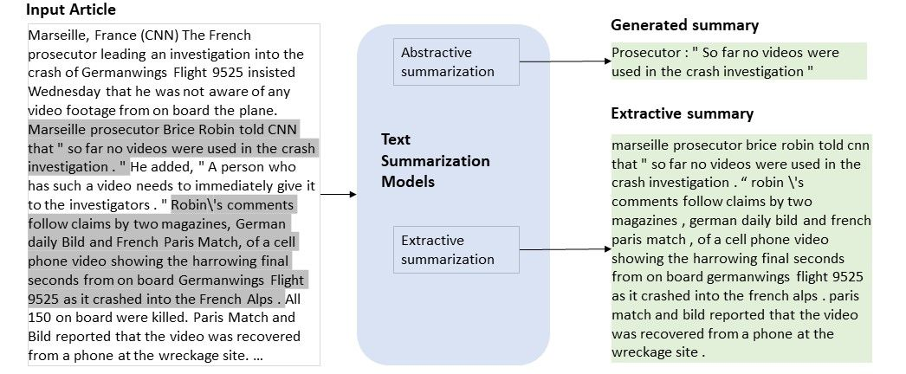

### Hi there 👋, my name is Nerat

I am a Data sciene and Machine learning enthusiast.

Skills: PYTHON / SQL 

- 🔭 I’m currently working on this page. 
- 🌱 I’m currently learning PowerBI and MS Excel
- 🤔 I’m looking for help with Data Science jobs 
- 📫 How to reach me: neratdazam2@gmail.com 
- 😄 Pronouns: She/Her 
- ⚡ Fun fact: I love gardening and decorating 
- 📒 Education: Bachelors of Science (Computer Science), *Landmark University*,

Here are some of the projects I've worked on:

# [Project 1: Lung Cancer Detection](https://github.com/Elilora/Lung-Cancer-Classification)

Photo by <a href="https://unsplash.com/@cdc?utm_source=unsplash&utm_medium=referral&utm_content=creditCopyText">CDC</a> on <a href="https://unsplash.com/s/photos/lung-cancer?utm_source=unsplash&utm_medium=referral&utm_content=creditCopyText">Unsplash</a>
  
This project uses lung Ct Scans to detect if a lung CT scan is benign, malignant or normal using various machine learning techniques like SVM classifier, KNN classifier, Ddecision tree classifier and random forest classifier.
* **Python libraries used:** Streamlit, Scikit- learn, SVM, KNN, Decision Tree, and Random Forest
* **Input:** Lung CT Scan
* **Output:** Result of detection

# [Project 2: Spam Text Detection](https://github.com/Elilora/Text-Classification)

Photo by <a href="https://developers.google.com/machine-learning/guides/text-classification/images/TextClassificationExample.png">Google developers</a>
  
This project uses Text Message corpus to detect if a text message is spam or ham using machine learning techniques like SVM classifier, KNN classifier, Ddecision tree classifier and random forest classifier.
* **Python libraries used:** Scikit- learn, Natural Language processing, Python
* **Input:** Message corpus
* **Output:** Classification of messages (Spam or Ham)

# [Project 3: Development of a text summarizer using Nlp and deep learning techniques](https://github.com/Elilora/EaseSumApp)

Photo by <a href="https://techcommunity.microsoft.com/t5/image/serverpage/image-id/180981i9EA877DDFF97D50D?v=v2">Microsft tech Community</a>

This project makes use of ***Natural Language Processing*** of text corpus to provided summarizered version of text
* **Python libraries used:** Streamlit, NLTK, TextRank
* **Input:** Text Corpus
* **Output:** summarizered text

Check out my Kaggle and Twitter Accounts:

  
