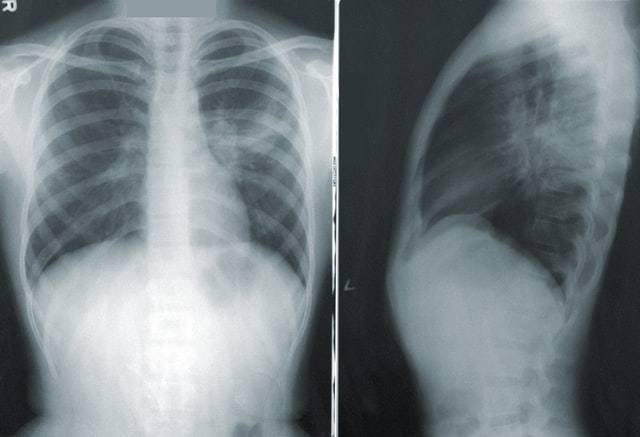

<h1 align="center">Hi 👋, I'm Nerat</h1>

<h3 align="center">A passionate Data scientist and Machine learning enthusiast. </h3>

- 🔭 I’m currently working on this page. 
- 🌱 I’m currently learning **ML deployment, PowerBI, LLMs, Generative AI**
- 🤔 I’m looking for Data Science jobs 
- 📫 How to reach me: neratldazam@gmail.com 
- 😄 Pronouns: She/Her 
- ⚡ Fun fact: I love gardening and decorating 
- 📒 Education: Bachelor of Science (Computer Science), *Landmark University*, Master of Science Data Science (In view), *Heriot Watt University*

Skills: PYTHON / SQL / MS EXCEL / KOBO TOOLBOX / POWERBI / JAVA/ D3 JAVASCRIPT / HTML / CSS

<h3 align="left">Languages and Tools:</h3>

              
 
 
 
 
 

Here are some of the projects I've worked on:

# Data Analysis
## [Project 1: Spotify Streaming Analysis ](https://app.powerbi.com/groups/me/reports/f27d5349-37d1-491e-862f-402d4866dcd1/ReportSection?experience=power-bi)

Photo by <a href="https://storage.googleapis.com/pr-newsroom-wp/1/2023/01/AppleCompetition-FTRHeader_V2-1440x733.png">Spotify</a> on <a href="https://newsroom.spotify.com/">Spotify</a>
  
This project analyzes streaming data from Spotify, a leading music streaming platform. An interactive dashboard is developed with PoerBI which offers insights into user listening habits, popular genres, artist trends, and more. By analyzing Spotify's vast dataset, the dashboard will provide valuable information for understanding user preferences and optimizing content recommendations.

* **Tool:**  Power BI
* **Input:** Spotify streaming data
* **Output:**  Interactive dashboard showcasing insights and trends in music streaming data

## [Project 2: Market Basket Analysis and Customer Segmentation](https://github.com/Elilora/Market-basket-analysis)

Photo by <a href="https://blogs.oracle.com/ai-and-datascience/post/overview-of-traditional-machine-learning-techniques">oracle</a> on <a href="https://www.kdnuggets.com/2019/12/market-basket-analysis.html">kdnuggets</a>
  
This project focuses on analyzing transactional data for groceries using market basket analysis techniques, this is done by identifying frequent itemsets and association rules and uncovering patterns in customer purchasing behaviour. Additionally, the project involves customer segmentation based on these patterns, utilizing KNN clustering to group customers with similar buying habits. Wordcloud visualization is employed to represent frequent itemsets.
* **Python libraries used:** Apriori, Wordcloud, KMeans clustering,
* **Input:** Transactional Data 
* **Output:** Association Rules, Customer Segmentation, Wordcloud Visualizations

# Data Science
## [Project 3: Lung Cancer Detection](https://github.com/Elilora/Lung-Cancer-Classification)

Photo by <a href="https://unsplash.com/@cdc?utm_source=unsplash&utm_medium=referral&utm_content=creditCopyText">CDC</a> on <a href="https://unsplash.com/s/photos/lung-cancer?utm_source=unsplash&utm_medium=referral&utm_content=creditCopyText">Unsplash</a>
  
This project uses lung CT Scans to detect if a lung CT scan is benign, malignant or normal using various machine learning techniques like SVM classifier, KNN classifier, Decision tree classifier and random forest classifier.
* **Python libraries used:** Streamlit, Scikit- learn, SVC
* **Input:** Lung CT Scan
* **Output:** Result of detection

## [Project 4: Spam Text Detection](https://github.com/Elilora/Text-Classification)

Photo by <a href="https://developers.google.com/machine-learning/guides/text-classification/images/TextClassificationExample.png">Google developers</a>
  
This project uses Text Message corpus to detect if a text message is spam or ham using machine learning techniques like SVM classifier, KNN classifier, Decision tree classifier and random forest classifier.
* **Python libraries used:** Scikit-learn, Natural Language Processing ToolKit 
* **Input:** Message corpus
* **Output:** Classification of messages (Spam or Ham)

## [Project 5: Development of a text summarizer using Nlp and deep learning techniques](https://github.com/Elilora/EaseSumApp)

Photo by <a href="https://techcommunity.microsoft.com/t5/image/serverpage/image-id/180981i9EA877DDFF97D50D?v=v2">Microsft tech Community</a>

This project makes use of ***Natural Language Processing*** of text corpus to provide a summarized version of the text
* **Python libraries used:** Streamlit, NLTK, TextRank
* **Input:** Text Corpus
* **Output:** summarized text

## [Project 6: Stroke Prediction](https://github.com/Elilora/Stroke-Prediction)

Photo by <a href="[https://techcommunity.microsoft.com/t5/image/serverpage/image-id/180981i9EA877DDFF97D50D?v=v2](https://www.istockphoto.com/photo/man-with-brain-stroke-symptoms-gm1168179084-322448882?utm_medium=organic&utm_source=google&utm_campaign=iptcurl)">istockphoto</a>

In this project three classifiers were used: Random Forest Classifier with 95% accuracy, Decision Tree Classifier with 91% accuracy, Support Vector Classifier with 95% accuracy. These classifiers were used to build models that predict if an individual has a stroke or not.
* **Python libraries used:** Scikit-learn, Pandas, Shap, Seaborn, Matplotlib
* **Input:** Stroke Prediction Dataset
* **Output:** Predicted output

<h3 align="left">Connect with me and check out my accounts:
</h3>

  

